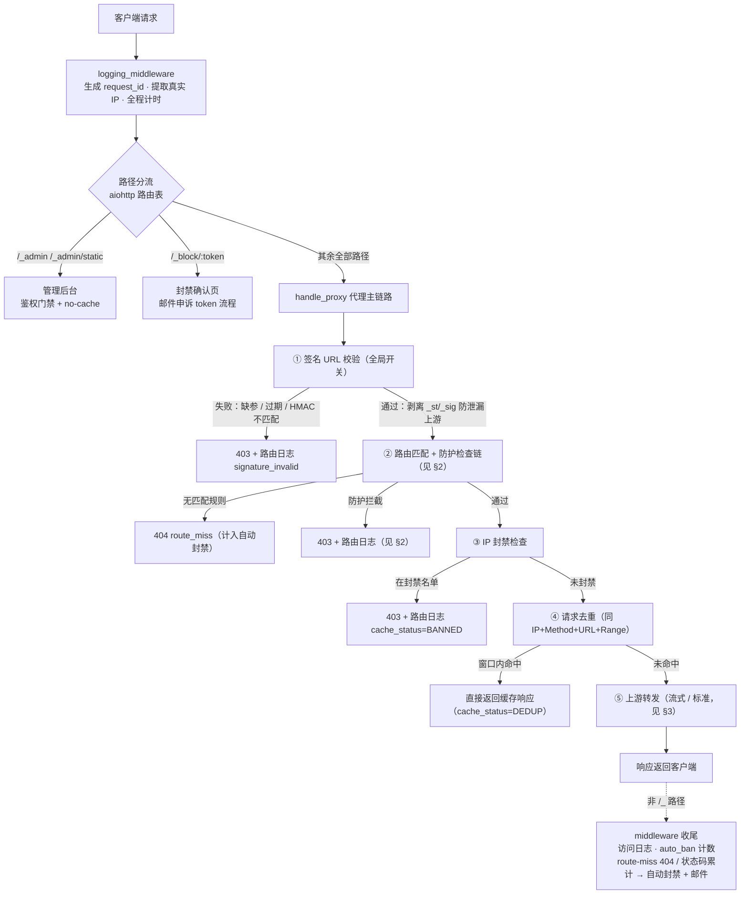
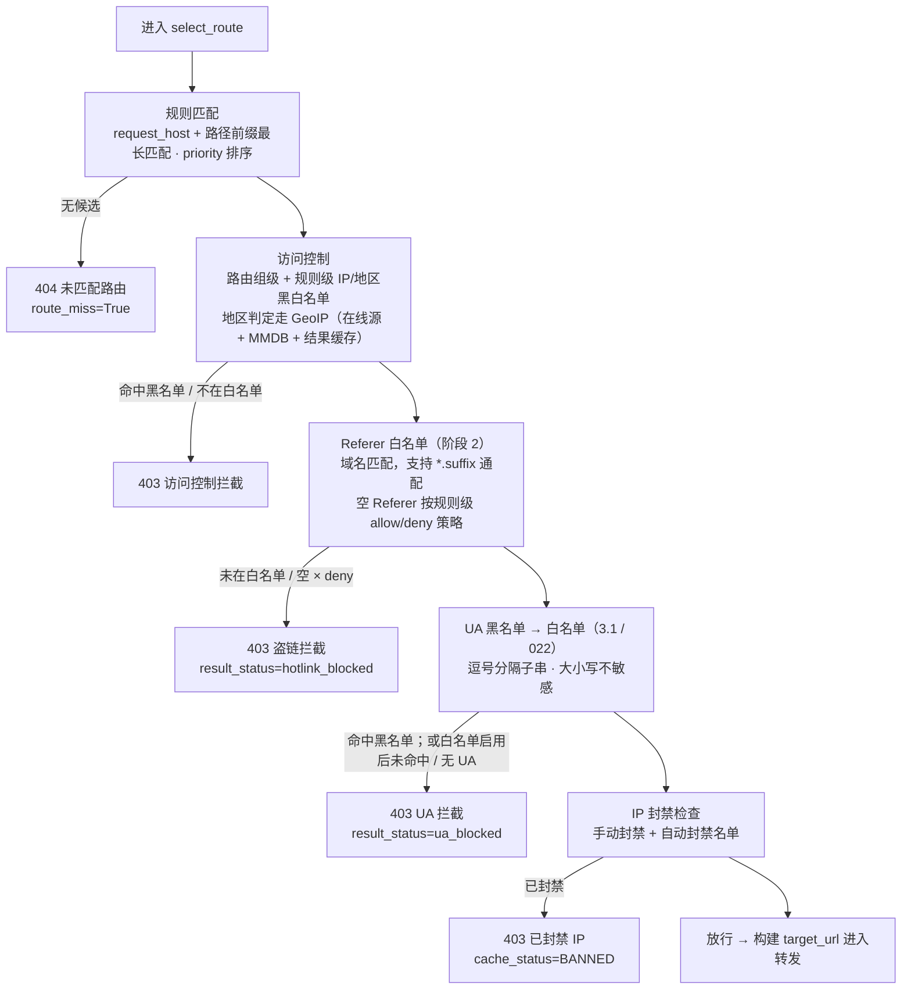
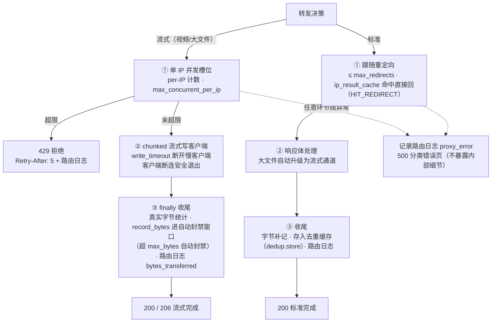

# 请求全链路流程图

> 维护说明：本文档与 `main.py` / `proxy_core.py` 当前实现逐段核实对齐（含 HOTLINK_PROTECTION.md 阶段 1-4 全部功能）。
> 改动请求处理链路时请同步更新本文档。最后更新：2026-09-05。

---

## 1. 全链路总览

要点：**每个阶段失败都会短路**——立即写一条路由日志（带对应 `result_status`）并返回错误页，不继续执行后续阶段。

---

## 2. 防护检查链（select_route 内部）

检查按「**先拦来源、再拦客户端**」排序；各检查**留空即不启用、零开销**。

设计细节：

- **UA 黑先白后**：同入黑白名单时显式拒绝优先。
- **黑名单对无 UA 放行**（不误伤部分本地播放器）；**白名单启用后无 UA 一并拦截**（防止不发 UA 绕过白名单）。
- 签名 URL 校验在 `select_route` **之前**（handle_proxy 入口），因此无 route_decision，日志用 error_message 前缀区分。

---

## 3. 上游转发双通道

`use_streaming = 规则级 enable_streaming 且 全局 streaming.enabled`

槽位释放由 `try/finally` 保证，传输结束才释放；`record_bytes` 把本次传输字节计入自动封禁窗口，窗口滑动重置。

---

## 4. 出口结果对照表

所有出口（含成功）都会写一条 `route_logs` 记录，供日志页筛选与盗链监控看板聚合。

| HTTP | result_status | cache_status | 触发条件 |
|------|---------------|--------------|----------|
| 403 | `signature_invalid` | `BLOCKED` | 签名开关开启：`_st/_sig` 缺失、过期或 HMAC 不匹配 |
| 404 | `no_route` | — | request_host + 路径前缀无匹配规则（计入自动封禁 route_miss） |
| 403 | `hotlink_blocked` | `BLOCKED` | Referer 未在白名单；空 Referer 且策略为 deny |
| 403 | `ua_blocked` | `BLOCKED` | UA 命中黑名单；或白名单启用后未命中 / 无 UA |
| 403 | `proxy_error`* | `BLOCKED` | 规则/路由组 IP·地区黑白名单拦截（原因在 error_message） |
| 403 | `proxy_error`* | `BANNED` | IP 在封禁名单（手动封禁或自动封禁已生效） |
| 原状态 | `forwarded` | `DEDUP` | 窗口内同 IP+Method+URL+Range 命中去重缓存 |
| 429 | `proxy_error`* | — | 流式单 IP 并发超限（响应头 `Retry-After: 5`） |
| 透传 | `forwarded` / `forwarded_client_error` / `upstream_error` | `BYPASS` / `HIT_REDIRECT` / `HIT_STREAMING` | 上游正常响应；≥400 分别归为上游 4xx / 上游 5xx |
| 500 | `proxy_error` | — | 转发链路异常（页面仅展示分类原因，不暴露内部细节） |
| 后续 403 | — | — | 流量封禁：窗口内累计字节超 `auto_ban.max_bytes`，自动封禁该 IP（可邮件告警） |

\* `proxy_error` 行的区别靠 `error_message` 字段区分。

---

## 5. 关键入口代码索引

| 环节 | 位置 |
|------|------|
| 路由注册与分流 | `main.py` `_setup_routes`（`/{path:.*}` 兜底进 `handle_proxy`） |
| logging_middleware | `main.py` `_setup_middleware` |
| 签名 URL 校验 + 参数剥离 | `main.py` `handle_proxy` 开头；核心在 `signed_url.py` |
| 防护检查链 | `proxy_core.py` `select_route`（访问控制 → `_check_referer` → `_check_ua_blacklist` → `_check_ua_whitelist`） |
| IP 封禁 / 去重 / 转发决策 | `main.py` `handle_proxy` 中段 |
| 并发槽位 / 流式收尾 | `main.py` `_send_streaming_response` / `_do_send_streaming_response` |
| 路由日志状态推断 | `main.py` `_infer_route_log_result_status` |
