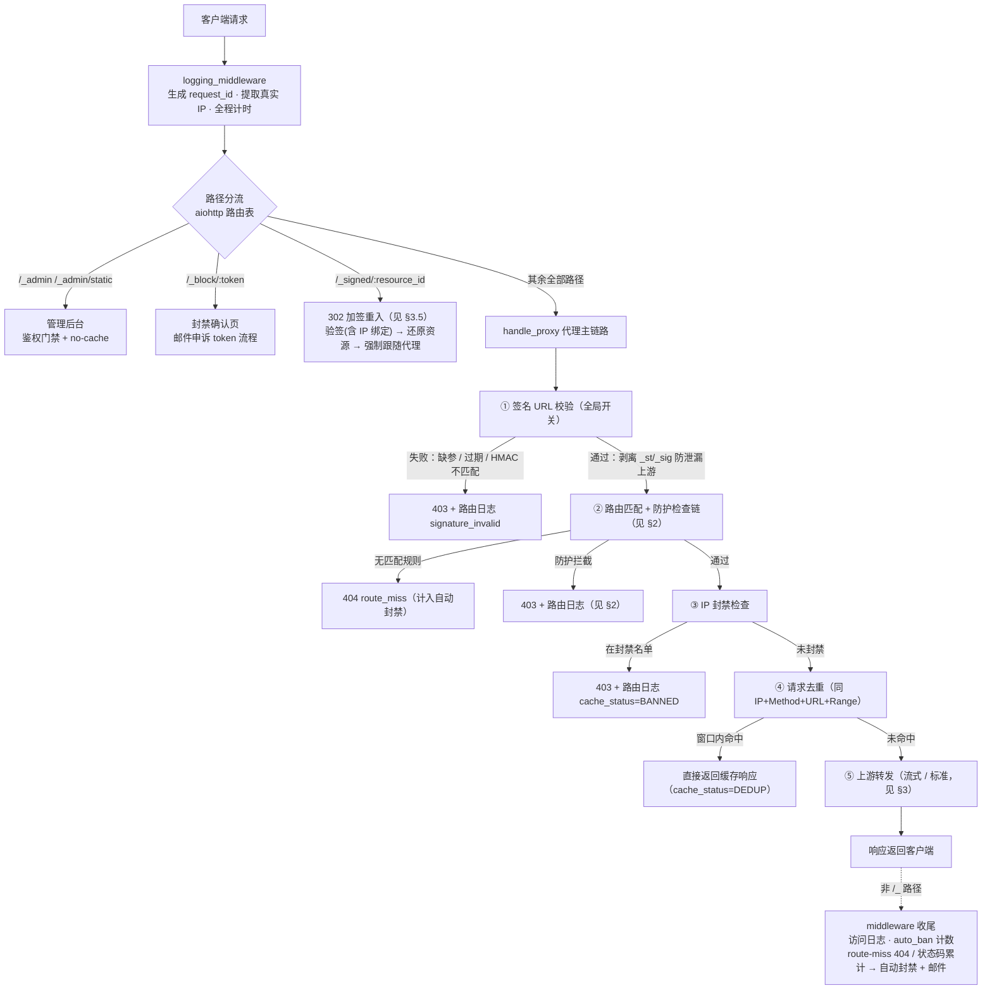
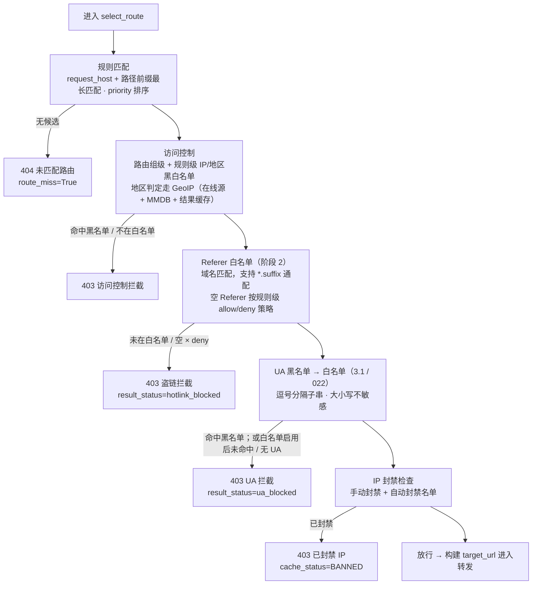
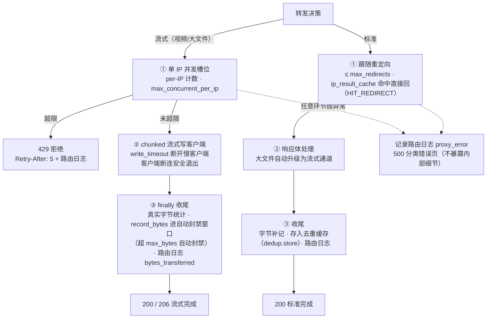
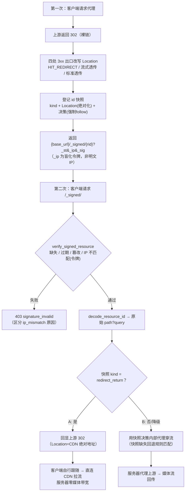

# 请求全链路流程图

> 维护说明：本文档与 `main.py` / `proxy_core.py` 当前实现逐段核实对齐（含 HOTLINK_PROTECTION.md 阶段 1-4 全部功能）。
> 改动请求处理链路时请同步更新本文档。最后更新：2026-09-05。

---

## 1. 全链路总览



要点：**每个阶段失败都会短路**——立即写一条路由日志（带对应 `result_status`）并返回错误页，不继续执行后续阶段。

---

## 2. 防护检查链（select_route 内部）

检查按「**先拦来源、再拦客户端**」排序；各检查**留空即不启用、零开销**。



设计细节：

- **UA 黑先白后**：同入黑白名单时显式拒绝优先。
- **黑名单对无 UA 放行**（不误伤部分本地播放器）；**白名单启用后无 UA 一并拦截**（防止不发 UA 绕过白名单）。
- 签名 URL 校验在 `select_route` **之前**（handle_proxy 入口），因此无 route_decision，日志用 error_message 前缀区分。

---

## 3. 上游转发双通道

`use_streaming = 规则级 enable_streaming 且 全局 streaming.enabled`



槽位释放由 `try/finally` 保证，传输结束才释放；`record_bytes` 把本次传输字节计入自动封禁窗口，窗口滑动重置。

---

## 3.5 302 加签改写（signed_redirect）

`redirect_signing_enabled` 开启时，返回客户端的 3xx `Location` 不再外发裸链，而是改写为
系统固定签名链接 `{base_url}/_signed/{resource_id}?_st&[_ip]&_sig`；客户端跟随回系统，
`/_signed/` 端点验签（`_ip` 仅含盲化令牌，与当前客户端 IP 重算令牌一致性 → 区分 `ip_mismatch`，
**链接中不再出现明文客户端 IP**）→ base64url 解码还原原始 path/query →
以「强制 follow_redirects」模式跑代理管道并代理出流。

**规则解耦 + 双模式（id 快照缓存）**：签发改写的同时把当时的路由决策快照、上游 302
状态码与解析后的绝对 Location 按 `resource_id` 登记（`ProxyRequestHandler._signed_cache`），
`kind` 由规则 `follow_redirects` 决定。`/_signed/` 领取按 kind 分流：

- **A 模式 `redirect_return`**（规则 `follow_redirects=False`）：回显缓存的上游 302，
  客户端自行跟随直连 CDN——媒体流量不过本服务器（等价加签前裸链）；
- **B 模式 `proxy_stream`**（规则 `follow_redirects=True`，或 A 的 Location 缺失时降级）：
  用快照内部代理穿流（媒体流量过本服务器）。



#### 3.5.1 逐跳链路（代码索引版）

**① 签发时（第一次请求，建快照）**

1. 客户端 `GET /play/xxx` → `handle_proxy`（`main.py:846`）
2. `select_route` 命中规则，读出 `rule.follow_redirects`（`main.py:904`）
   - **关键（2026-09-05 修复）**：首次代理请求（非 `/_signed` 重入）固定
     `force_external_redirect=True`（`main.py:1028`），使 `RedirectHandler` 的
     `follow_redirects=(False if force_external_redirect else rule.follow_redirects)`
     （`proxy_core.py:1886` / `:2321`）**强制为 False**——无论规则 `follow_redirects` 取值，
     上游 3xx 都原样返回并命中四处改写点（`:1914`/`:2136`/`:2304`/`:2399`）生成签名链接。
     修复前 B 模式规则（`follow_redirects=True`）首次请求会内部跟随上游直出 200，完全跳过加签流程。
     （仅 `/_signed` 重入 `_signed_reentry` 命中快照时 `force_external_redirect=False`，允许内部跟随。）
   - **关键（2026-09-05 二次修复）**：改写成功后同步 `redirect_info.redirect_url = 改写后的签名链接`
     （四处改写点均用 `replace(redirect_info, redirect_url=rewritten)`：`proxy_core.py:1914`/`:2136`/`:2304`/`:2399`），
     使路由日志 `redirect_location` 如实记录**实际返回给客户端的签名链接**，而非上游裸 CDN 地址。
     注意：流式实时改写（`:2136`）用独立 `log_redirect_info` 变量、不原地改 `redirect_info`，
     以免污染 `ip_cache.put_redirect`（`:2167`）误存签名链接、破坏后续重入重签。
3. 代理打上游 → 上游返回 `302`，`Location = 裸 CDN 地址`
4. `_build_rewritten_redirect`（`proxy_core.py:557`）改写 `Location` 为 `302 /_signed/{id}`，
   同时 `_remember_signed_redirect`（`proxy_core.py:488`）登记快照（`kind` 由 `follow_redirects` 决定）：
   ```python
   kind = "redirect_return" if not rule.follow_redirects else "proxy_stream"
   self._signed_cache[resource_id] = {
       "decision": replace(rule, follow_redirects=True),  # 强制跟随快照
       "kind": kind,
       "location": urljoin(原公共入口, 上游302 Location),  # 相对→绝对
       "status": 上游302状态码,
       "created": now,
   }
   ```
   （`location` 相对地址按「原公共请求 URL」解析为绝对地址，保证回显后客户端跟随到的目标
   与加签前裸链语义完全一致）
5. 客户端收到 `302 Location=/_signed/{id}`

**② 领取时（第二次请求，按快照分流）**

1. 客户端 `GET /_signed/{id}?_st&_sig&_ip` → `handle_signed_resource`（`main.py:749`）
2. `verify_signed_resource` 验签（`_ip` 为盲化令牌：以当前客户端 IP 重算令牌与链接令牌比对，
   一致才继续；失败直接 `403`，reason 区分 `missing/expired/invalid/ip_mismatch`）
3. `decode_resource_id` 还原 `path?query`（`base64url`，无状态、重启安全）
4. `get_signed_redirect_entry(resource_id)` 按 id 换取签发时快照（`main.py:819`）

- **A 模式（`kind=redirect_return`）→ 走 CDN 流量**（规则 `follow_redirects=False`）
  ```python
  if entry.get("kind") == "redirect_return" and entry.get("location"):
      return web.Response(status=entry["status"],
                          headers={"Location": entry["location"]})
  ```
  → 直接回显签发时缓存的上游 `302`（绝对 CDN 地址），客户端自行跟随直连 CDN 拉流，
  **服务器零媒体带宽**；日志记 `cache_status="SIGNED_ECHO"`、`transport_mode="redirect"`。
  回显内容与加签前裸链完全一致，无服务器侧重入循环。

- **B 模式（`kind=proxy_stream`）→ 走本地服务器流量**（规则 `follow_redirects=True`，
  或 A 的 Location 缺失时降级）
  ```python
  decision = entry.get("decision")
  request["_signed_route_decision"] = decision
  return await self.handle_proxy(request)
  ```
  → `handle_proxy` 内 `main.py:899` 命中 `_signed_route_decision`，**跳过 `select_route`**
  （链路口志「路由:签名快照」），用强制跟随的 decision 快照**内部代理穿流**，
  媒体经服务器回传；**永不外发 3xx**（防循环）。
  - **日志准确性（2026-09-05 修复）**：客户端实际拿到的是 `200`（服务器代理穿流），并无外部重定向。
    但 `redirect_handler` 内部跟随上游会把 `redirect_count=1` / `redirect_location=上游URL` 写进 `redirect_info`，
    这只是服务器内部跳板，**不应在路由日志/链路日志里显示为"重定向"**——
    `_build_route_log_payload`（`main.py:694-695`）对 `request["_signed_reentry"]` 强制把
    `redirect_count`/`redirect_location` 归零；标准路径的 `重定向:{N}` 链路口志（`main.py:1087-1088`）
    也加 `not _signed_reentry` 守卫，避免与紧随的 `代理:200` 自相矛盾。
    （内部上游跳板详情仍可在链路口志「上游耗时」/`上游首包较慢` 看到，诊断能力不丢。）

**关键设计点**

| 点 | 说明 |
|----|------|
| 重入绕开规则匹配 | 凭 id 换快照；规则被删/改**不影响已签发链接**（修复前即线上 404 复现场景） |
| 防循环 | A 回显加签前那条裸链；B 永不外发 3xx |
| 无状态/重启安全 | `resource_id` 是 `base64url(path?query)`；`decision` 快照在内存缓存（TTL 默认 21600s，1 万上限，`_signed_cache_prune` 淘汰） |
| 降级 | 快照缺失/过期 → 落入 `handle_proxy` 走常规 `select_route` 重新匹配规则（「新签发」仍需规则在场） |
| 验签 | `_ip` 仅含盲化令牌（`_blind_ip(client_ip)` 的 HMAC 值，**URL 不暴露明文 IP**），`bind_ip` 可配；换 IP 使用 → `ip_mismatch` 拒绝，防止链接被他人冒领 |

要点：`/_signed/` A 模式回显的是**加签前原始 3xx**（客户端跟随行为不变），B 模式内部代理
穿流（强制跟随、永不外发 3xx）——两种模式均无新增循环；IP 绑定默认开启（`_ip` 仅盲化令牌
+ HMAC 覆盖真实 IP 防篡改，**URL 不再含明文客户端 IP**），移动网络切换需重新取地址。

---

## 4. 出口结果对照表

所有出口（含成功）都会写一条 `route_logs` 记录，供日志页筛选与盗链监控看板聚合。

| HTTP | result_status | cache_status | 触发条件 |
|------|---------------|--------------|----------|
| 403 | `signature_invalid` | `BLOCKED` | 签名开关开启：`_st/_sig` 缺失、过期或 HMAC 不匹配 |
| 403 | `signature_invalid` | `BLOCKED` | 302 加签重入 `/_signed/` 验签失败（缺失/过期/篡改/换 IP 使用，error_message 区分 ip_mismatch） |
| 302/307 | `forwarded` | `SIGNED_ECHO` | A 模式领取：`/_signed/` 换取签发时缓存的上游 302（客户端直连 CDN，本机零媒体带宽） |
| 404 | `no_route` | — | request_host + 路径前缀无匹配规则（计入自动封禁 route_miss） |
| 403 | `hotlink_blocked` | `BLOCKED` | Referer 未在白名单；空 Referer 且策略为 deny |
| 403 | `ua_blocked` | `BLOCKED` | UA 命中黑名单；或白名单启用后未命中 / 无 UA |
| 403 | `proxy_error`* | `BLOCKED` | 规则/路由组 IP·地区黑白名单拦截（原因在 error_message） |
| 403 | `proxy_error`* | `BANNED` | IP 在封禁名单（手动封禁或自动封禁已生效） |
| 原状态 | `forwarded` | `DEDUP` | 窗口内同 IP+Method+URL+Range 命中去重缓存 |
| 429 | `proxy_error`* | — | 流式单 IP 并发超限（响应头 `Retry-After: 5`） |
| 透传 | `forwarded` / `forwarded_client_error` / `upstream_error` | `BYPASS` / `HIT_REDIRECT` / `HIT_STREAMING` | 上游正常响应；≥400 分别归为上游 4xx / 上游 5xx |
| 500 | `proxy_error` | — | 转发链路异常（页面仅展示分类原因，不暴露内部细节） |
| 后续 403 | — | — | 流量封禁：窗口内累计字节超 `auto_ban.max_bytes`，自动封禁该 IP（可邮件告警） |

\* `proxy_error` 行的区别靠 `error_message` 字段区分。

---

## 5. 关键入口代码索引

| 环节 | 位置 |
|------|------|
| 路由注册与分流 | `main.py` `_setup_routes`（`/{path:.*}` 兜底进 `handle_proxy`） |
| logging_middleware | `main.py` `_setup_middleware` |
| 签名 URL 校验 + 参数剥离 | `main.py` `handle_proxy` 开头；核心在 `signed_url.py` |
| 302 加签改写 | `signed_url.py` `build_signed_redirect`/`verify_signed_resource`；出口改写 `proxy_core.py` `_build_rewritten_redirect`；id 双模式快照 `proxy_core.py` `_remember_signed_redirect`/`get_signed_redirect_entry`；端点 `main.py` `handle_signed_resource`（A 回显 302 / B 内部代理） |
| 防护检查链 | `proxy_core.py` `select_route`（访问控制 → `_check_referer` → `_check_ua_blacklist` → `_check_ua_whitelist`） |
| IP 封禁 / 去重 / 转发决策 | `main.py` `handle_proxy` 中段 |
| 并发槽位 / 流式收尾 | `main.py` `_send_streaming_response` / `_do_send_streaming_response` |
| 路由日志状态推断 | `main.py` `_infer_route_log_result_status` |
